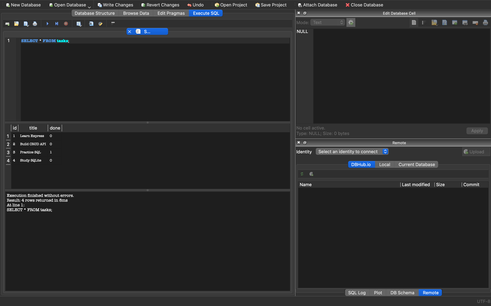

# Task API with SQLite

A RESTful Task Management API built using **Node.js**, **Express.js**, and **SQLite**.

This project demonstrates how to build a CRUD (Create, Read, Update, Delete) API with persistent storage using SQLite instead of an in-memory array.

---

## Features

- Create a new task
- Get all tasks
- Get a task by ID
- Update a task
- Delete a task
- Persistent data storage with SQLite
- Interactive API documentation using Swagger UI

---

## Technologies Used

- Node.js
- Express.js
- SQLite
- better-sqlite3
- Swagger UI

---

## Installation

Clone the repository:

```bash
git clone <your-repository-url>
cd task-api-sqlite
```

Install dependencies:

```bash
npm install
```

---

## Run the Application

```bash
node server.js
```

The server will start on:

```
http://localhost:3002
```

Swagger documentation:

```
http://localhost:3002/docs
```

---

## Database

The project uses a SQLite database named:

```
tasks.db
```

The database is automatically created when the server starts.

The `tasks` table contains:

| Column | Type |
|---------|------|
| id | INTEGER |
| title | TEXT |
| done | INTEGER |

---

## API Endpoints

| Method | Endpoint | Description |
|---------|----------|-------------|
| GET | /tasks | Get all tasks |
| GET | /tasks/:id | Get task by ID |
| POST | /tasks | Create a task |
| PUT | /tasks/:id | Update a task |
| DELETE | /tasks/:id | Delete a task |

---

## Example SQL Queries

```sql
SELECT * FROM tasks;

INSERT INTO tasks (title, done)
VALUES ('Learn SQL', 0);

UPDATE tasks
SET done = 1
WHERE id = 1;

DELETE FROM tasks
WHERE id = 1;
```

---

## Project Structure

```
task-api-sqlite/
│
├── database.js
├── server.js
├── tasks.db
├── openapi.json
├── package.json
├── README.md
└── node_modules/
```

## Database Screenshot

The SQLite database opened in DB Browser after executing `SELECT * FROM tasks;`.


---

## Author

Muhammed Luthfi TP
